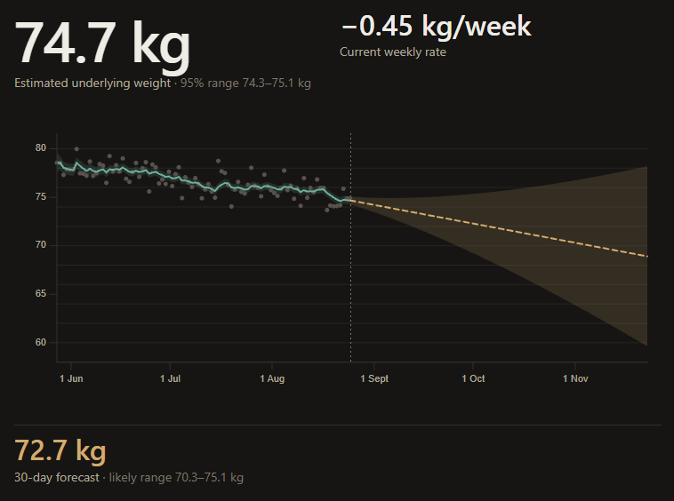
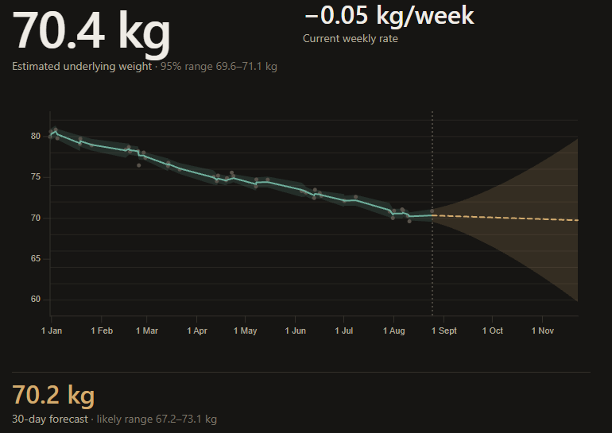
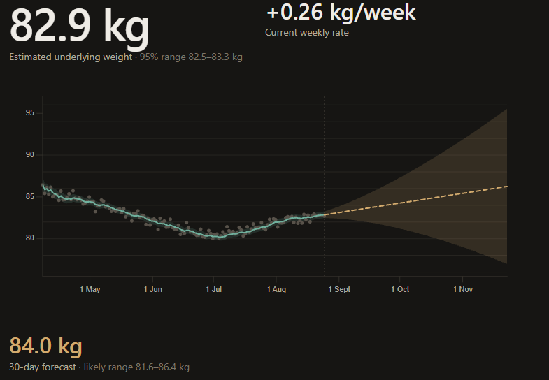
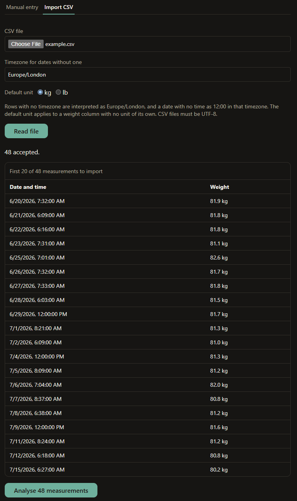

# HealthTrend

**Your scale is lying to you — not by much, but by more than the signal you are looking for.**
HealthTrend estimates the *underlying* weight trajectory behind noisy readings, says how confident it
is, and forecasts where the trajectory is heading.

### ▶ [**Try the live demo →**](https://healthtrend-sigma.vercel.app)



<sub>Grey dots are the raw weigh-ins. The teal line is the estimated latent weight. The dashed line
and shaded cone are the forecast and its 95% interval. Synthetic demo data.</sub>

---

## The problem

A scale reading moves with hydration, food still being digested, sodium, glycogen, and what time you
stepped on it. Day-to-day differences are mostly measurement noise, not weight change. So the two
things people actually want — *what is my weight really doing?* and *where is it heading?* — are not
visible in the numbers themselves.

HealthTrend treats that as an estimation problem: it models the measurement noise explicitly, and
reports both what it infers and how sure it is.

## What it does

- **Separates signal from noise** — estimates latent weight and trend velocity, not a moving average
- **Quantifies its own uncertainty** — every number carries a 95% interval, throughout
- **Forecasts 7, 30 and 90 days ahead** — with a band that widens honestly with horizon
- **Handles irregular weigh-ins** — gaps, bursts, any timezone, any order, kg or lb
- **Imports your CSV history** — or takes measurements typed in by hand
- **Stores nothing** — no accounts, no database, no browser storage

## How it works

A **local linear trend state-space model**, estimated with a **Kalman filter**.

The state is two numbers — latent weight *w* and its velocity *v* — evolving as an integrated Wiener
process, with each scale reading treated as a noisy observation of *w* alone. Three consequences do
most of the work.

**Time is elapsed time, not a step index.** The transition and process-noise matrices are functions
of the actual interval Δt, so a fortnight's gap widens the uncertainty by exactly as much as fourteen
daily steps would — and weighing yourself twice in one morning is two updates, not a contradiction.
Irregular data needs no resampling, interpolation or gap-filling.

<table>
<tr>
<td width="50%"></td>
<td width="50%"></td>
</tr>
<tr>
<td><sub><b>Irregular timing.</b> Sparse, uneven weigh-ins — the interval widens through the gaps and
tightens on new evidence.</sub></td>
<td><sub><b>Trend reversal.</b> Velocity is part of the state, so a genuine turn is tracked rather
than smoothed away.</sub></td>
</tr>
</table>

**Uncertainty is propagated, not decorated.** The filter carries a full covariance, with Joseph-form
updates for numerical stability, so the intervals on weight, on weekly rate and on every forecast all
fall out of the same recursion instead of being estimated separately.

**The forecast is analytic.** Projecting the state forward gives a closed-form Gaussian at each
horizon — no simulation, no sampling.

The model parameters are **documented priors, not values fitted to data**. Every equation, and the
code symbol implementing it, is in [docs/mathematics.md](docs/mathematics.md); the reasoning behind
each choice is in the [architecture decision records](docs/decisions/).

## Bring your own data

<table>
<tr>
<td width="45%"></td>
<td valign="top">

Upload a CSV of weight history, or enter measurements by hand — both feed the same analysis endpoint.

The importer resolves the awkward parts explicitly rather than guessing. Rows without a timezone are
interpreted in one you choose; a date with no time becomes midday in that zone; a weight column with
no unit of its own takes a default you set. Rows are parsed, counted and previewed before anything is
analysed.

There is a sample file at [sample_data/example.csv](sample_data/example.csv).

</td>
</tr>
</table>

## Privacy, enforced by tests

Real health data never enters the repository, the logs, or the browser's storage — and this is
checked mechanically rather than promised:

- **Nothing is persisted.** No accounts, no database. A test statically scans the whole frontend
  source for `localStorage`, `sessionStorage`, IndexedDB and `document.cookie`, and fails if any of
  them appear.
- **Nothing leaks through errors or logs.** Sentinel weight values are pushed through the failure
  paths; the tests fail if a sentinel ever surfaces in a message or a log line.
- **The access log is metadata-only.** uvicorn's built-in access log is disabled and the application
  writes its own ([docs/privacy.md](docs/privacy.md)).
- **Only synthetic, explicitly-labelled data is committed.**

The same approach guards the architecture. The dependency direction — `api → services → core` — is
enforced by an AST scan in the test suite rather than by convention: the numerical core stays
importable with no web framework present, and nothing below the API layer may import upward.

The contract between the two halves is machine-checked too. The frontend's TypeScript types are
generated from the backend's own OpenAPI document, and CI regenerates them and fails on any
difference — so a backend schema change breaks the build rather than production.

Every guarantee above is a CI gate, not a guideline: both suites run on each push (pytest; Vitest
with Testing Library and `axe` accessibility assertions), alongside `ruff`, strict `mypy`, ESLint,
`tsc` and a production build.

---

## Running it locally

**Backend** — requires [uv](https://docs.astral.sh/uv/). From `backend/`:

```bash
uv sync                        # provision Python 3.11 and dependencies
uv run pytest -q               # full test suite
uv run ruff check .            # lint
uv run mypy app                # strict type checking
```

`HEALTHTREND_ALLOWED_ORIGINS` is the CORS allow-list for the browser-side real-data page
(`/analyse`). It is empty by default and fails closed, so nothing is permitted until you name the
frontend's origin. `--no-access-log` disables uvicorn's access log as privacy hardening: that log
records request metadata — method, raw path, query string — never JSON bodies, but raw paths are
caller-controlled strings, and the application writes its own metadata-only log instead.

```bash
# bash / zsh
HEALTHTREND_ALLOWED_ORIGINS=http://localhost:3000 uv run uvicorn app.main:app --no-access-log

# PowerShell
$env:HEALTHTREND_ALLOWED_ORIGINS = "http://localhost:3000"; uv run uvicorn app.main:app --no-access-log
```

**Frontend** — requires Node (version pinned in [frontend/.nvmrc](frontend/.nvmrc)). From
`frontend/`, with the backend already running:

```bash
npm ci                         # install from the committed lockfile
npm run gen:api                # regenerate TypeScript types from backend/openapi.json
npm run test                   # Vitest + Testing Library + axe
npm run dev                    # http://localhost:3000
```

Copy [frontend/.env.example](frontend/.env.example) to `.env.local` to point at a backend that is not
on `localhost:8000`. Two variables exist because two request paths exist:

- `HEALTHTREND_API_URL` — used by the demo pages (`/demo/{scenario}`), fetched from a Next.js server
  component, so it never reaches the browser. There is no client-side data fetching, state library or
  caching layer on that path: switching scenarios is a URL change handled by the router.
- `NEXT_PUBLIC_HEALTHTREND_API_URL` — used by the real-data page (`/analyse`), which calls
  `POST /api/analyse` and `POST /api/ingest/csv` directly from the browser. This is why the backend
  needs that origin in `HEALTHTREND_ALLOWED_ORIGINS` above.

Opening `/` redirects to `/demo/gradual-loss`.

### API

| Endpoint | Purpose |
| --- | --- |
| `GET /health` | liveness |
| `POST /api/analyse` | analyse submitted weigh-ins |
| `POST /api/ingest/csv` | parse an uploaded CSV into observations for `/api/analyse` |
| `GET /api/demo` | list the synthetic demo scenarios |
| `GET /api/demo/{scenario}` | analyse one of them |
| `GET /docs`, `GET /openapi.json` | interactive docs and the machine-readable contract |

```bash
curl localhost:8000/api/demo/gradual-loss

curl -X POST localhost:8000/api/analyse -H 'content-type: application/json' -d '{
  "observations": [
    {"timestamp": "2026-08-01T07:30:00+01:00", "weight": 72.4, "unit": "kg"},
    {"timestamp": "2026-08-08T07:20:00+01:00", "weight": 71.9, "unit": "kg"}
  ]
}'
```

Horizons are fixed at 7, 30 and 90 days, measured from **now** by default — so a stale series carries
the extra elapsed uncertainty. The response publishes `origin_timestamp`,
`last_observation_timestamp` and `lead_days`; pass `"forecast_from": "last_observation"` for the
series-relative view.

## Documentation

| Document | Contents |
| --- | --- |
| [docs/mathematics.md](docs/mathematics.md) | Every equation, and the code symbol that implements it |
| [docs/architecture.md](docs/architecture.md) | Layer boundaries and the dependency rules |
| [docs/privacy.md](docs/privacy.md) | What must never be committed or logged |
| [docs/decisions/](docs/decisions/) | Architecture decision records (ADR-0001 to ADR-0010) |

## Limitations

The estimator is demonstrated on five synthetic scenarios. **No accuracy or robustness claims are
made**: the parameters are priors chosen and documented up front, not values fitted to data, and the
model has not been calibrated or benchmarked against a real dataset.

Not implemented: Apple Health parsing, trend classification, plateau detection, change detection,
goal projection, robust outlier handling, RTS smoothing, baseline comparison, calibration study,
contextual machine learning, accounts.

## Not a medical device

HealthTrend estimates and forecasts a measurement trend. It does not diagnose, treat or prescribe.

## License

[MIT](LICENSE) © 2026 Alfred Hong
