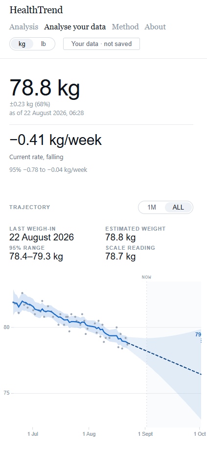
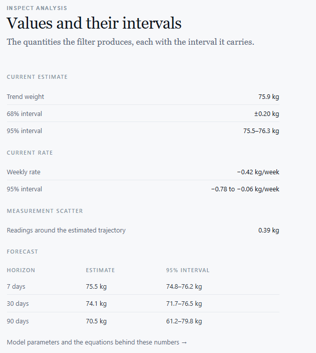
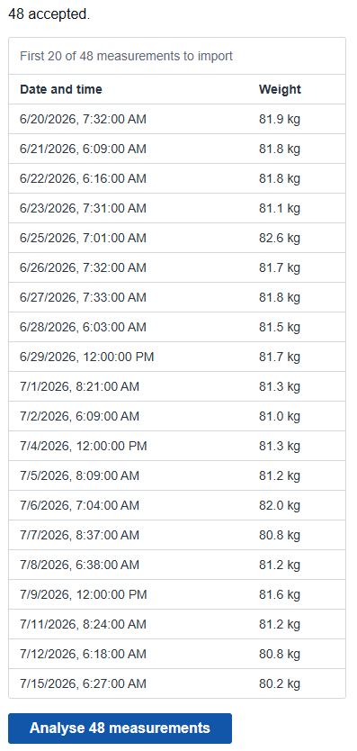

# HealthTrend

**HealthTrend tells you what your weight is actually doing, not merely what the scale said.**

It estimates the underlying weight trajectory behind noisy, irregular scale readings, states how
confident it is, and forecasts where that trajectory is heading.

### [Open the live demo →](https://healthtrend-sigma.vercel.app/v2/gradual-loss)

**Status:** V2 is deployed and is the public, recruiter-facing version of the product. The
statistical core, the HTTP boundary, the V2 analysis experience and the own-data flow are shipped and
in use. Development is ongoing.


<sub>Grey dots are raw weigh-ins. The blue line is the estimated underlying weight, the shaded band
its 95% range, and the dashed continuation the forecast. Synthetic demonstration series.</sub>

---

## What HealthTrend does

A single scale reading moves with hydration, food still being digested, sodium, glycogen and the time
of day you stepped on. Day-to-day differences are mostly measurement noise, not weight change. The
two questions people actually want answered, *what is my weight really doing* and *where is it
heading*, are therefore not visible in the readings themselves.

HealthTrend treats that as an estimation problem rather than a display problem:

- **Takes noisy and irregularly spaced measurements.** Gaps, bursts, several readings in one day, any
  timezone, kg or lb.
- **Estimates the underlying weight trajectory**, not a moving average, with velocity carried as part
  of the state.
- **Estimates the current rate of change** in kg/week, the number that answers "am I progressing"
  more directly than any single weight does.
- **Quantifies its own uncertainty.** Every published quantity carries the interval the filter's
  covariance actually produces.
- **Produces probabilistic forecasts** at 7, 30 and 90 days, plus a daily forecast path with a band
  that widens with horizon.
- **Accepts your own data**, typed in by hand or imported from a CSV history.
- **Lets you inspect the reasoning**, through a Why → Evidence → Statistics detail stack.
- **Documents the model** on a dedicated [Method](https://healthtrend-sigma.vercel.app/v2/method)
  page, down to the equations and the code that implements them.

This is trajectory intelligence, not a weight logger. Logging is the cost of entry here, not the
value.

---

## Analyse your own data

### [Try it with your own measurements →](https://healthtrend-sigma.vercel.app/v2/analyse)



Enter measurements manually or import a CSV export. Weights can be given in kg or lb and are
normalised to kilograms at the boundary. Timestamps carrying a UTC offset are used as given; naive
timestamps are localised against an IANA timezone you choose, using that specific date's rule, so a
summer row and a winter row in the same zone resolve correctly. Ambiguous and non-existent local
times across a clock change are reported as such rather than silently guessed.

Real measurements render through **exactly the same V2 presentation** as the synthetic scenarios:
same hero, same canvas, same statistics band, same inspection tiers. There is no reduced "your data"
mode.

**Nothing is persisted.** No accounts, no database, no session, no browser storage, no telemetry.
Measurements are sent to the analysis service to produce the result on screen and are not stored;
a reload starts from an empty page. Editing an input or switching entry mode discards the result
rather than leaving a stale analysis beside changed inputs.

---

## Explainability


The product is a hierarchy, and each layer is reachable from the one above it:

```
Conclusion → Why → Evidence → Statistics → Method
```

- **Conclusion** is one plain sentence about this series.
- **Why** is specific to this analysis: the latest reading beside the estimate for the same instant,
  the difference between them, the measurement-noise assumption in force, and how the projection
  follows from the rate.
- **Evidence** is what the estimate rests on: readings used, span, days without a reading, readings
  per week, and the recent readings themselves.
- **Statistics** is the numbers with their intervals.
- **Method** is a separate destination, not a tier, because generic model documentation reads
  identically on every series and does not belong on the everyday analysis screen.

**The language layer does not invent statistical findings.** The wording is a deterministic
presentation of published numbers. "Trending down" is stated only when the rate's own 95% interval
excludes zero, and "flat within its uncertainty" otherwise; that is a fact about an interval the
backend computed, not a confidence label. Capabilities the model does not have are absent entirely
rather than rendered as "unknown". There is no trend classification, no plateau detection, no
change-point marker, no goal ETA and no outlier flagging in this product, so none of them appear
anywhere in the interface.

A target weight, and optionally a target weekly rate, can be added. The distance to the target and
the comparison against the current estimated rate are transparent arithmetic over published numbers,
so both are shown; an arrival date is not, because that would need a hitting-time distribution the
backend does not compute. Goal state is held for the duration of the visit and written nowhere.

---

## Statistics and uncertainty



What the Statistics tier actually exposes, all of it derived from quantities the backend publishes:

| Quantity | What it is |
| --- | --- |
| Trend weight | The current estimated underlying weight, with 68% and 95% intervals |
| Weekly rate | The current rate in kg/week, with a genuine 95% interval from the velocity posterior |
| Measurement scatter | The spread of readings around the estimated trajectory, described as exactly that and never as a filter innovation |
| Forecast | The 7, 30 and 90-day estimates, each with a 95% interval |

Uncertainty is propagated through the covariance rather than decorated on afterwards, so the interval
on the weight, the interval on the rate and the interval on every forecast all fall out of the same
recursion.

---

## The statistical model

A **continuous-time local linear trend state-space model**, estimated with a **Kalman filter**.

The state is two numbers, latent weight `w` and its velocity `v`, evolving as an integrated Wiener
process. Each scale reading is treated as a noisy observation of `w` alone. Four properties do most
of the work:

**Time is elapsed time, not a step index.** The transition matrix `F(Δt)` and the process-noise
matrix `Q(Δt)` are functions of the real interval between readings, so a fortnight's gap widens the
uncertainty by exactly as much as fourteen daily steps would, and two weigh-ins on the same morning
are two updates rather than a contradiction. Irregular and fractional intervals need no resampling,
interpolation or gap-filling.

**The process noise is the exact integral, not an approximation.** For the integrated-acceleration
process, `Q(Δt) = ∫₀^Δt F(s) Q_c F(s)' ds`, which evaluates in closed form to
`σ_a² · [[Δt³/3, Δt²/2], [Δt²/2, Δt]]`. That form satisfies `F(b) Q(a) F(b)' + Q(b) = Q(a+b)`, so
splitting an interval and stepping through it gives identically the same covariance as taking it in
one step. Irregular spacing is therefore exact rather than tolerated (ADR-0002).

**The covariance update is Joseph form.** Chosen for numerical stability over the shorter algebraic
form; symmetry and positive-definiteness are maintained explicitly rather than assumed.

**Forecasts are analytic.** Propagating the state forward gives a closed-form Gaussian at each
horizon, so the 7, 30 and 90-day intervals are computed, not simulated or sampled.

The model parameters are **documented priors, not values fitted to data**. Nothing is trained on user
measurements, and the estimator is structurally goal-neutral: there is no parameter through which a
user's lose, maintain or gain intent could reach it.

Deeper reading: the [Method page](https://healthtrend-sigma.vercel.app/v2/method) and its
mathematical appendix, and [docs/mathematics.md](docs/mathematics.md), which indexes every equation
against the code symbol implementing it.

---

## Evaluation, and what it did not show

The estimator was evaluated on synthetic data, where the hidden trajectory is known because it was
generated. The full account, including every result that went against the model, is in
[docs/evaluation/report.md](docs/evaluation/report.md); the measurements themselves are in
[docs/evaluation/results.md](docs/evaluation/results.md), which is generated from committed result
files and re-rendered by a test that fails on any drift.

**What the evidence supports:**

- **The arithmetic is right.** The filter's log-likelihood was checked against an independent
  joint-Gaussian formulation of the same model, built from marginal covariances and evaluated with a
  single Cholesky factorisation rather than a recursion. Across an 810-case battery the sequential
  and lean recursions agree to `2.1e-14` relative, and the independent computation adjudicates 781 of
  those cases and agrees to better than `1e-8`. Forecast means and variances match the conditional
  moments of the same joint distribution. On the worst ill-conditioned case, 60-digit exact
  arithmetic puts the filter's error at `7.4e-13` and the double-precision oracle's at `3.7e-05`, so
  the check rather than the estimator is the party losing accuracy there. That exact-arithmetic
  comparison is kept as a permanent test.
- **Calibration is approximately nominal under the model's own assumptions.** Over 1,000 simulated
  series (500 on a daily schedule, 500 on a deliberately awkward irregular one), latent-weight
  coverage was 94.9% and velocity coverage 94.9% against a nominal 95%, with all eight calibration
  checks within 0.73 standard errors. Inference is clustered by series, because posteriors within one
  trajectory are not independent.
- **Irregular spacing costs no calibration**, which is the process-noise splitting identity above
  working as claimed, now measured rather than argued.

**What the evidence went against:**

- **The process-noise intensity `σ_a` is not identifiable from a month of data**, at any weighing
  frequency. Thirty readings and three hundred readings over the same month both fail to close the
  interval; calendar span, not reading count, is what identifies trend flexibility. A year of data
  with only 30 readings identifies it about six times better than 300 readings crammed into a month.
- **Short histories therefore do not support reliable per-user maximum-likelihood fitting.** At 30
  daily readings the median fitted process-noise estimate sits at the floor of the search space in
  54% of replicates. A per-user fit on the data a real user has after a month would report the shape
  of its own search space with an air of having measured something. Production parameters remain
  documented fixed priors for now.
- **The estimator is not uniformly better than simpler methods.** On the 30-day forecast metric, the
  horizon the product actually claims, a tuned Holt beat the shipped estimator in 6 of 8 tested
  synthetic regimes, and a Kalman filter with parameters fitted to the regime beat it in 5 of 8. The
  shipped estimator was best on the model-correct regime and on smooth curvature. **No method won
  uniformly**, challengers included, and every baseline was tuned on the exact shape it was then
  tested on, which no deployment could arrange.
- **Intervals degrade under misspecification.** They are calibrated when the model holds and
  demonstrably are not when it does not: on a genuine level shift, the 30-day interval covered the
  truth 48% of the time against a nominal 95%.

**What is explicitly not claimed.** No clinical or medical validation. No real health data has been
used for any evaluation, so there is no demonstrated forecast accuracy on real people. No claim that
the model is the right model, that the shipped parameter values are correct, or that a Kalman filter
beats simpler methods in general.

The point of the section is the shape of the evidence, not its polish. The project measures where the
model works and where it loses rather than assuming that a more sophisticated method must be a better
one.

---

## Engineering

**Backend.** FastAPI and NumPy, Python 3.11, managed with [uv](https://docs.astral.sh/uv/). The
dependency direction `api → services → core` is enforced by an AST scan in the test suite rather than
by convention, and `app/core` is checked against an import allowlist: no web framework, no clock, no
randomness, no filesystem, no environment access. The core is deterministic, so committed golden
fixtures make an accidental change to the mathematics loud instead of silent. Any warning fails the
build.

**Frontend.** Next.js 16 (App Router), React 19, TypeScript, CSS Modules and visx. Chart shaping is
pure and lives outside React and outside the HTTP layer, so what the chart draws is unit-testable
without rendering anything.

**The contract between them is generated, not hand-written.** `backend/openapi.json` is committed and
produced from the app; `frontend/src/lib/api/schema.d.ts` is generated from that document and never
edited by hand. CI regenerates both and fails on any diff, so a backend schema change breaks the
build rather than production.

**Ingestion.** CSV parsing with per-row unit declarations, a chosen default unit, IANA timezone
resolution for naive timestamps with correct DST behaviour, explicit handling of ambiguous and
non-existent local times, and a parsed preview with counts before anything is analysed. Manual entry
uses the same validation path.

**Privacy is a test, not a promise.** A static check fails the build if `localStorage`,
`sessionStorage`, IndexedDB or `document.cookie` appears anywhere under `frontend/src`. Sentinel
weight values are pushed through the failure paths and the suite fails if one ever surfaces in an
error message or a log line. The access log carries counts and route templates only; error responses
come from an explicit table rather than exception text. Only synthetic, explicitly-labelled data is
committed, and `.gitignore` blocks real exports.

**Responsive.** The V2 composition holds from narrow mobile viewports through desktop, in one column
on small screens and a centred two-column analysis surface on wide ones. The chart stays the primary
surface at every width without permanently consuming half a phone screen.

**Validation at the final local run:**

| Check | Result |
| --- | --- |
| `npm run test` (Vitest, Testing Library, `axe`) | 290 passed, 38 files |
| `npm run lint` | clean |
| `npm run typecheck` | clean |
| `npm run build` | clean |
| `uv run pytest -q` | 840 passed |

CI runs the same commands in two independent workflows on every push, alongside `ruff`, `ruff format`
and strict `mypy`.

---

## CSV ingestion



Rows are parsed, counted and previewed before anything is analysed. The importer resolves the awkward
parts explicitly rather than guessing: a row with no UTC offset is localised against the timezone you
select, a date with no time becomes midday in that zone (ADR-0010), and a weight column with no unit
of its own takes the default you set. The committed sample above is
[sample_data/example.csv](sample_data/example.csv), a synthetic 48-row history across 63 days with
deliberate gaps and deliberately date-only rows.

---

## About

### [Read the About page →](https://healthtrend-sigma.vercel.app/v2/about)

I built HealthTrend after finding daily scale readings genuinely frustrating while cutting.
Individual measurements moved around substantially for reasons that had nothing to do with fat loss,
while what I cared about was the underlying direction and how fast it was moving. The About page has
the rest.

---

## Running it locally

**Backend**, from `backend/`, requires [uv](https://docs.astral.sh/uv/):

```bash
uv sync --locked               # provision; fails on a drifted lockfile
uv run pytest -q               # full test suite
uv run ruff check .            # lint
uv run mypy                    # strict type checking
```

`HEALTHTREND_ALLOWED_ORIGINS` is the CORS allow-list for the browser-side routes. It is empty by
default and fails closed, so nothing is permitted until you name the frontend's origin.
`--no-access-log` disables uvicorn's access log as privacy hardening; the application writes its own
metadata-only log instead.

```bash
# bash / zsh
HEALTHTREND_ALLOWED_ORIGINS=http://localhost:3000 uv run uvicorn app.main:app --no-access-log

# PowerShell
$env:HEALTHTREND_ALLOWED_ORIGINS = "http://localhost:3000"; uv run uvicorn app.main:app --no-access-log
```

**Frontend**, from `frontend/`, with the backend already running. Node version is pinned in
[frontend/.nvmrc](frontend/.nvmrc):

```bash
npm ci                         # install from the committed lockfile
npm run gen:api                # regenerate TypeScript types from backend/openapi.json
npm run test                   # Vitest + Testing Library + axe
npm run dev                    # http://localhost:3000
```

Copy [frontend/.env.example](frontend/.env.example) to `.env.local` to point at a backend that is not
on `localhost:8000`. Two variables exist because two request paths exist: `HEALTHTREND_API_URL` is
read server-side by the scenario pages and never reaches the browser, while
`NEXT_PUBLIC_HEALTHTREND_API_URL` is used by the own-data route, which calls the API directly from
the browser and is why that origin must appear in `HEALTHTREND_ALLOWED_ORIGINS`.

The V2 routes are `/v2/{scenario}`, `/v2/analyse`, `/v2/method` and `/v2/about`; `/v2` alone lands on
`gradual-loss`. Scenarios are `gradual-loss`, `plateau`, `reversal`, `noisy` and `irregular`, all
synthetic and labelled as such. The earlier V1 presentation is still served at `/demo/{scenario}` and
`/analyse` against the same API.

### API

| Endpoint | Purpose |
| --- | --- |
| `GET /health` | liveness |
| `POST /api/analyse` | analyse submitted weigh-ins |
| `POST /api/ingest/csv` | parse an uploaded CSV into observations for `/api/analyse` |
| `GET /api/demo` | list the synthetic demo scenarios |
| `GET /api/demo/{scenario}` | analyse one of them |
| `GET /docs`, `GET /openapi.json` | interactive docs and the machine-readable contract |

```bash
curl localhost:8000/api/demo/gradual-loss

curl -X POST localhost:8000/api/analyse -H 'content-type: application/json' -d '{
  "observations": [
    {"timestamp": "2026-08-01T07:30:00+01:00", "weight": 72.4, "unit": "kg"},
    {"timestamp": "2026-08-08T07:20:00+01:00", "weight": 71.9, "unit": "kg"}
  ]
}'
```

Horizons are fixed at 7, 30 and 90 days and are measured from **now** by default, so a stale series
carries the extra elapsed uncertainty. The response publishes `origin_timestamp`,
`last_observation_timestamp` and `lead_days`; pass `"forecast_from": "last_observation"` for the
series-relative view.

---

## Repository navigation

```
backend/   FastAPI + NumPy, uv-managed, Python 3.11
  app/core/       pure layer: units · time_axis · types · model · kalman · filter · forecast · analyse
  app/schemas/    Pydantic wire contract        app/demo/      synthetic scenarios
  app/ingestion/  observations and CSV parsing  app/services/  clock, forecast-origin policy
  app/api/        routes, error table, metadata-only access log
  evaluation/     the M6 studies, importable by nothing in app/
  tests/          core · api · layering · committed golden fixtures
  openapi.json    committed contract, generated from the app
frontend/  Next.js 16 · React 19 · TypeScript · CSS Modules · visx · Vitest
  src/app/v2/         the shipped V2 routes: [scenario] · analyse · method · about
  src/components/v2/  V2Hero · V2Canvas · V2Summary · V2StatsBand · V2Inspector · V2Method · V2About
  src/lib/            api/ (schema.d.ts generated) · chart/ (pure shaping) · v2/ · privacy/
docs/      mathematics · architecture · privacy · evaluation · decisions/ · product/ · design/
sample_data/  the only place a committed .csv is permitted
```

| Document | Contents |
| --- | --- |
| [docs/mathematics.md](docs/mathematics.md) | Every equation, and the code symbol implementing it |
| [docs/architecture.md](docs/architecture.md) | Layer boundaries and the dependency rules |
| [docs/privacy.md](docs/privacy.md) | What must never be committed or logged |
| [docs/evaluation/report.md](docs/evaluation/report.md) | What the estimator was measured to do, including where it loses |
| [docs/evaluation/results.md](docs/evaluation/results.md) | The measurements themselves (generated) |
| [docs/product/V2_PRODUCT.md](docs/product/V2_PRODUCT.md) | What HealthTrend is for |
| [docs/design/V2_DESIGN.md](docs/design/V2_DESIGN.md) | The V2 design direction and the honesty ledger |
| [docs/decisions/](docs/decisions/) | Architecture decision records, ADR-0001 to ADR-0011 |

## Not implemented

Stated so the absences are not read as oversights: trend classification, plateau or change-point
detection, goal hitting-time or ETA, robust outlier handling, RTS smoothing, per-user parameter
fitting, accounts and persistent history, Apple Health or smart-scale integration, body-composition
inference, and real-data evaluation.

## Not a medical device

HealthTrend estimates and forecasts a measurement trend. It does not diagnose, treat or prescribe,
and it makes no claim about health outcomes.

## License

[MIT](LICENSE) © 2026 Alfred Hong
